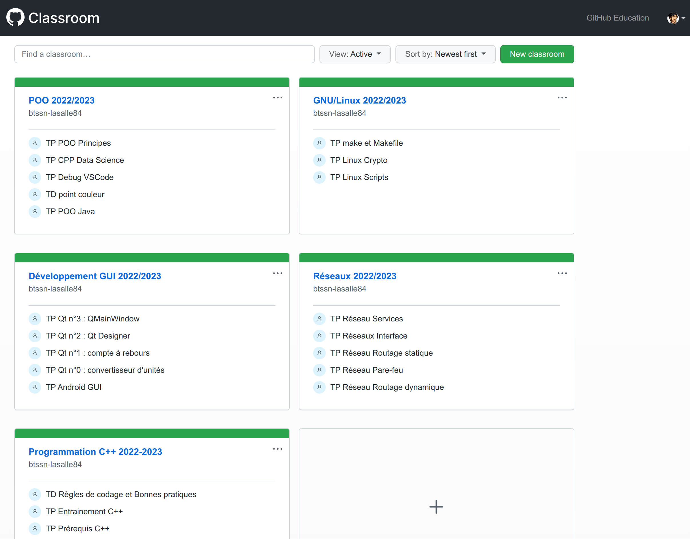
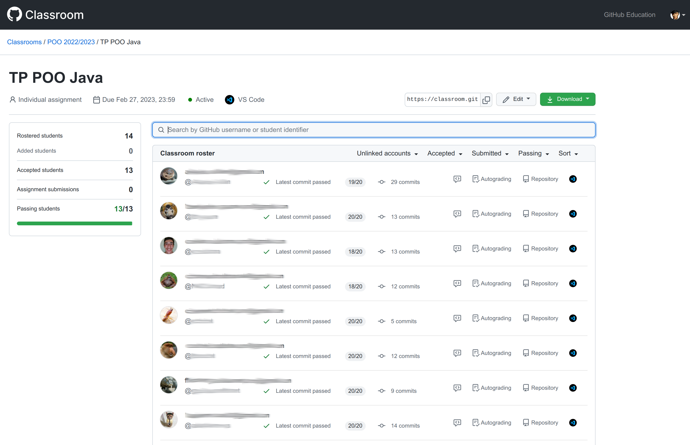
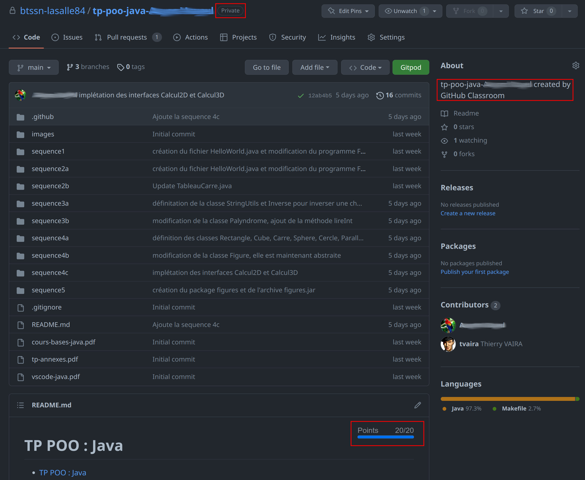
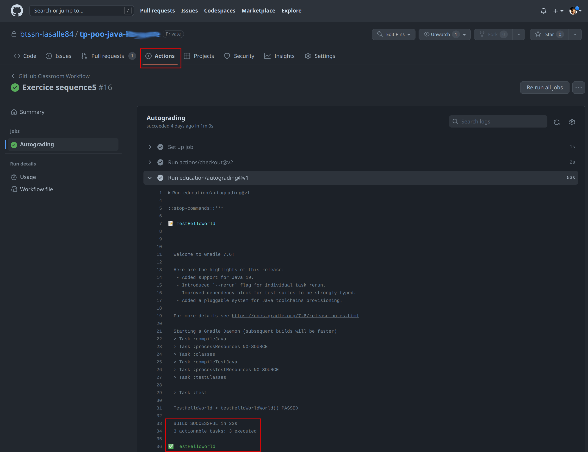
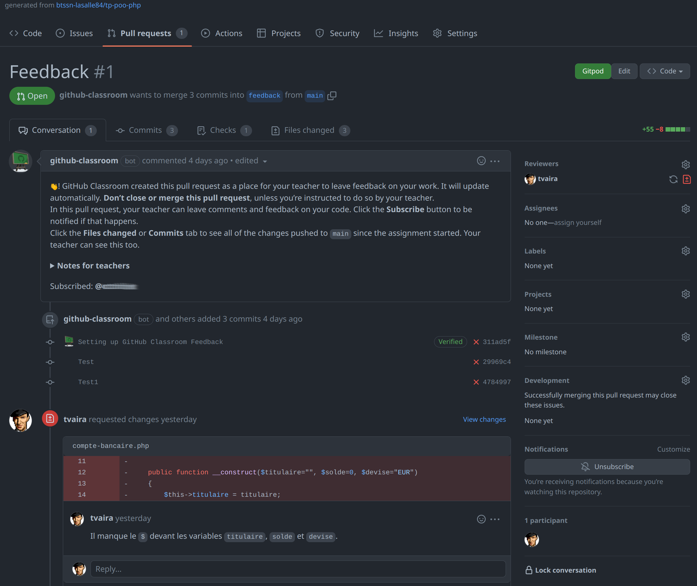
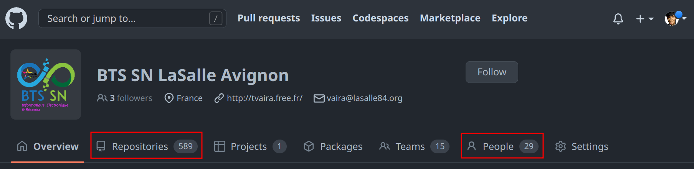

# Github Classroom

[Github](https://github.com/) a un programme pour l'[éducation](https://docs.github.com/fr/education) qui comprend l'excellent outil [Github Classroom](https://classroom.github.com/).

[Github Classroom](https://classroom.github.com/) permet de gérer des devoirs dans une salle de classe et surtout de les automatiser.

Un petit [guide](https://btssn-lasalle84.github.io/guides-developpement-logiciel/guide-classroom.html) en complément des très bons [tutoriels](https://docs.github.com/fr/education/manage-coursework-with-github-classroom/get-started-with-github-classroom/basics-of-setting-up-github-classroom) de la plateforme.

## Des modèles de devoir

Chaque exemple de devoir intègre la notation automatique avec sa visualisation sous forme de badge :

- 

    https://github.com/btssn-lasalle84/tp-poo-cpp

-   

    https://github.com/btssn-lasalle84/tp-script-bash

-  

    https://github.com/btssn-lasalle84/tp-poo-cpp

    https://github.com/btssn-lasalle84/tp-poo-qt

-  

    https://github.com/btssn-lasalle84/tp-poo-java

    https://github.com/btssn-lasalle84/tp-poo-android

- 

    https://github.com/btssn-lasalle84/tp-poo-python

- 

    https://github.com/btssn-lasalle84/tp-poo-php

- 

    https://github.com/btssn-lasalle84/tp-poo-javascript

-  

    https://github.com/btssn-lasalle84/tp-poo-dart

    https://github.com/btssn-lasalle84/tp-poo-flutter

## Aperçu

Ma salle de classe pour cette année :

La vue d'ensemble pour un devoir :

Le dépôt privé d'un étudiant automatiquement créé par [Github Classroom](https://classroom.github.com/) avec l'évolution de la note à chaque _commit/push_ :

Chaque _commit/push_ déclenche un _workflow_ dans Github Actions :

Lors de la création du devoir, il est possible d’y associer une _Pull Request_ _Feedback_ pour assurer une communication Étudiant/Enseignant sur ce devoir (mettre des commentaires et/ou répondre aux questions d’un étudiant) :

Les devoirs sont hébergés dans une organisation :

---
Thierry Vaira : **[thierry(dot)vaira(at)gmail(dot)com](mailto:thierry.vaira@gmail.com)**
